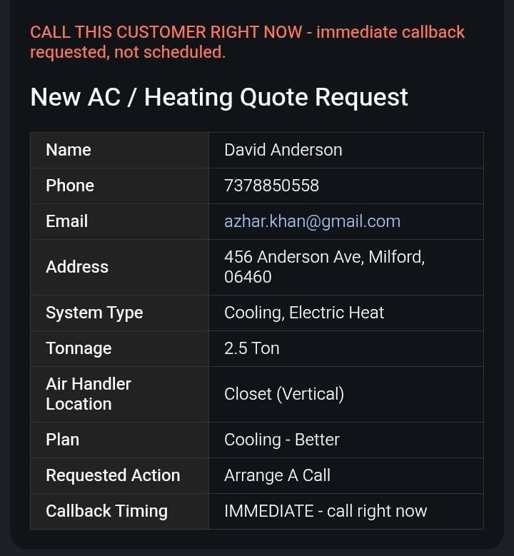
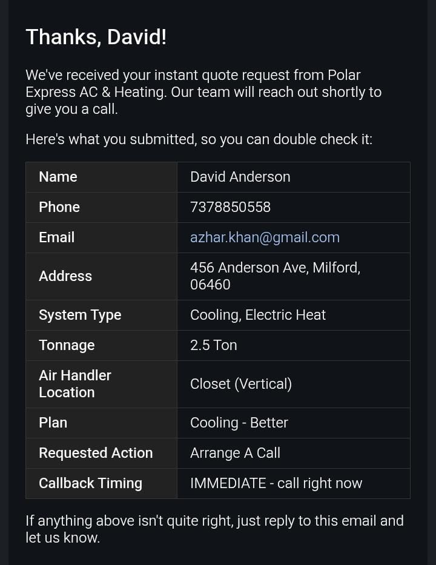

<div align="center">

# AI_Voice_RFQ

</div>

**A speech-to-speech voice bot that replaces a multi-step web quote form with a real phone-call-like conversation — built for a live HVAC client and hardened against real production calls.**

[](./ARCHITECTURE.md)
[-412991?style=for-the-badge&logo=openai&logoColor=white&labelColor=000000)](#)
[](#)

---

## 🎥 Demo

> This bot is embedded on a **live paying client's website**. There's no public demo link here on purpose — every session opens a real, metered connection to OpenAI's Realtime API, and a recruiter (or a hundred of them) running test calls would put a real bill on the client's account. Instead:

<!--
  To embed a real playable video: open README.md on github.com in the web editor,
  drag your video file directly into the text box. GitHub uploads it and inserts a
  raw URL on its own line, like:
  https://github.com/user-attachments/assets/xxxxxxxx-xxxx-xxxx-xxxx-xxxxxxxxxxxx
  Leave that URL on its own line, unwrapped by [ ]( ) — that's what makes GitHub
  render it as an inline, clickable, playable video instead of a plain link.
  Paste it below, replacing this comment block.
-->

https://github.com/user-attachments/assets/PASTE-YOUR-VIDEO-URL-HERE

*Full call walkthrough — greeting → caller answers by voice → live transcript updates → lead delivered.*

| Lead delivered by email | Callback booked on Google Calendar |
|---|---|
|  |  |

---

## ⚡ What It Does

```
Caller talks (or types, as a fallback)
                ↓
   Bot asks the same questions the old quote form asked
                ↓
   name → phone → email → address → system type → tonnage
                ↓
   Instant plan match + pricing, spoken back live
                ↓
   Lead delivered by email — same inbox the old form used
```

| | |
|---|---|
| **Input** | Caller's voice, streamed live from the browser mic (typed/tapped fallback always available) |
| **Voice engine** | OpenAI Realtime API — one continuous two-way audio connection per call, no separate STT/TTS round trip |
| **Brain** | A deterministic finite state machine in plain Python — **not the model** — decides every question, price, and plan |
| **Guarantee** | The model can never invent a price, a plan, or skip a question. The worst it can do is mishear you and ask you to repeat yourself |
| **Deployment** | Standalone widget + API, embedded via one `<script>` tag — the client's original WordPress site and manual form are untouched |

---

## 🧠 The Core Design Problem

An LLM speaking freely can hallucinate a price, invent a plan that doesn't exist, or misquote availability. For something that turns directly into a real sales lead, that's not an acceptable failure mode — not occasionally, not ever.

**The fix:** the model is only ever allowed to call a tool — `confirm_slot(field, value)` — never to compose a reply itself. For every stage, the tool's schema is rebuilt on the fly with `value` locked to a strict JSON `enum` of the real option IDs for *that exact question*. The model isn't just told the right answer — it's **structurally incapable** of sending one that isn't real. Every price and every spoken sentence comes from a plain Python string template in `state_machine.py`, never from the model's memory.

This narrows the AI's actual job to one thing: turning messy human speech into a clean value. It parses. It never decides what's true.

---

## 🏗️ Architecture

Audio flows **directly between the browser and OpenAI over WebRTC** — the backend is never in the audio path. Its only two jobs at call time: mint a short-lived token once, at call start, and run business logic over plain REST, once per tool call.

```
Browser (realtime-widget.js)
   │  WebRTC audio, both directions — never touches the backend
   ▼
OpenAI Realtime API
   │  data channel "oai-events" — tool calls, transcripts, turn signals
   ▼
Browser translates a tool call → REST request
   │
   ▼
FastAPI  POST /api/session/{id}/tool-call
   │
   ▼
realtime_tools.call_tool()  →  deterministic functions:
   DialogueManager · plan_matcher · notify · session_store · calendar_service
   │
   ▼
state_machine.py  — the FSM
   full_name → phone → email → street → city → zip → category → tonnage →
   location → plan_choice → review_summary → plan_action → call_timing →
   schedule_appointment → closing
```

**Why this shape:** an earlier version relayed audio through the backend over a WebSocket, which put it in the audio path twice per frame and caused real choppy/laggy audio under load. Moving to a direct WebRTC connection between the browser and OpenAI removes the backend from the audio path entirely — it can no longer be a bottleneck or failure point for live audio, no matter what else it's doing.

---

## 🔬 Key Engineering Decisions

| Decision | Why |
|---|---|
| Model can only call `confirm_slot(field, value)`, schema rebuilt per stage | Removes any path for the model to invent a price, plan, or question — wrong answers are structurally impossible, not just discouraged |
| Prices, plans, and every spoken line live in `state_machine.py`, not the prompt | A hallucination-proof source of truth that's also unit-testable with zero API key or network access |
| Audio goes browser ⟷ OpenAI directly (WebRTC); backend only ever sees REST | The backend can't be a bottleneck or failure point for live audio — a slow business-logic call can never make the caller's voice choppy |
| Ephemeral client token, minted server-side per call | The browser never sees the real `OPENAI_API_KEY` — only a short-lived, scoped credential |
| A response-creation queue in the frontend | Up to six different triggers (tool call, button tap, typed text, push-to-talk, OpenAI's own VAD) can each try to start a spoken response at once — OpenAI rejects a second one mid-flight |
| Blocking I/O (SMTP, Twilio, Calendar) runs off the main thread | Without this, one slow network call froze live audio for the whole call |
| Conversation history trimmed after every completed turn | Per-turn token cost was growing linearly with call length. The FSM's real state lives in `session.slots` on the backend — old turns were never actually needed in-model-context |
| CSV-backed pricing (`plans.csv` + `plan_availability.csv`), hot-reloaded on file mtime | Changing a price is a one-line CSV edit — no code change, no redeploy, no restart |

---

## 🐛 Real Bugs Found & Fixed

Each of these was traced through logs against actual test calls — not guessed at.

- **Greeting text leaking into a slot value** — the bot's own opening line was, on one path, getting treated as the caller's answer to the first question. Fixed by routing the greeting so it can only ever be spoken, never passed through slot-confirmation.
- **Six competing triggers racing to start a spoken response** — a tool call finishing, a button click, typed text, push-to-talk release, and OpenAI's own VAD could all fire at once; OpenAI rejects a second `response.create` mid-flight. Fixed with a client-side queue that drops stale/unscripted entries instead of replaying them out of order.
- **A send after the data channel had already closed threw an uncaught `InvalidStateError` and crashed the tab.** Fixed by routing every send through one `safeSend()` wrapper that checks channel state first.
- **A retry bug meant a failed response waited out OpenAI's full ~60s rate-limit reset window** instead of a short capped backoff — a live caller can't sit through a minute of silence. Fixed with a proper exponential backoff, capped in both count and delay.
- **Per-turn token cost grew with call length** as full audio history stayed in context. Fixed by trimming older conversation items after each successful turn — the FSM's real state already lives server-side, so nothing was actually lost.
- **A blocking network call (SMTP/Twilio/Calendar) froze the entire call's audio** for as long as it took (~8s observed on "call me now"). Fixed by moving those handlers off the main event loop.
- **A single call could be billed 2–3× on a mid-call reconnect.** Fixed by gating the charge behind a flag stored on the session.

Full write-up, including config rationale for every non-obvious tuning value, in [`ARCHITECTURE.md`](./ARCHITECTURE.md#13-known-issues-drift--technical-debt).

---

## 🛠️ Tech Stack

| Layer | Technology |
|---|---|
| Voice / Realtime |   |
| Backend |    |
| Dialogue Engine | Deterministic FSM, plain Python — no framework, no LLM in the decision path |
| Frontend |  — no build step, no framework, one file |
| Integrations |   SMTP · WordPress webhook |
| Infra |  Railway / cPanel (dual deployment) |

---

## 🗂️ Project Structure

```
ai-voice-rfq/
├── backend/
│   ├── main.py                    FastAPI app — every HTTP/WS endpoint, session lifecycle
│   ├── config.py                  every tunable setting, one place
│   ├── dialogue/
│   │   ├── slots.py                 fixed-order question definitions
│   │   └── state_machine.py         THE FSM — stage transitions, every spoken template, all prices
│   ├── services/
│   │   ├── realtime_tools.py        the model's entire tool-calling API surface + guard rails
│   │   ├── extraction.py            messy speech/text → clean structured value
│   │   ├── plan_matcher.py          CSV-backed pricing/availability, hot-reloaded on file change
│   │   ├── notify.py                lead delivery: WordPress webhook → SMTP → local file
│   │   ├── session_store.py         SQLite: sessions, leads, usage, bookings, API keys
│   │   ├── calendar_service.py      optional Google Calendar booking, fails gracefully
│   │   ├── call_service.py          "call me now" — urgent email + optional Twilio call
│   │   └── realtime_session.py      WebSocket relay — fallback transport, not used by default
│   └── tests/                     pytest suite — zero API key or network access required
└── frontend/
    ├── index.html / style.css       widget UI, no build step
    ├── realtime-widget.js           the entire live frontend — WebRTC handshake, tool dispatch
    └── audio-worklets.js            mic/playback processors for the relay fallback path
```

Full file-by-file breakdown, database schema, and the known-issues log: [`ARCHITECTURE.md`](./ARCHITECTURE.md).

---

## 🚀 Run It Locally

```bash
cd backend
python -m venv venv && source venv/bin/activate
pip install -r requirements.txt
cp .env.example .env        # add OPENAI_API_KEY, plus optional SMTP/Twilio/Calendar/WP settings
uvicorn main:app --reload --port 8000
```

Open `http://localhost:8000` — FastAPI serves the frontend directly from the same origin.

```bash
# Mobile testing (mic access needs HTTPS on a phone)
npx localtunnel --port 8000

# Check what a call actually cost, instead of guessing
curl http://localhost:8000/api/session/<session_id>/usage

# Run tests — no API key needed, only pure deterministic functions are exercised
cd backend && python -m pytest tests/ -v
```

---

## 🚧 Honest Limitations

| | |
|---|---|
| **Session state is in-process** | `SESSIONS`/`SESSION_LOCKS` are Python dicts — fine for a single-process pilot deployment, needs to move to Redis before horizontal scaling |
| **No server-side transcript log on the live path** | The WebRTC path's transcript exists client-side only, for the duration of the tab — durable per-turn logging would be new work |
| **Fallback relay path is unmaintained** | Recent rate-limit/retry/trim fixes live only in the current WebRTC frontend, not ported to the WebSocket fallback path |
| **Cost estimate, not a billing record** | Per-call token/cost figures are computed against hardcoded rate assumptions — confirm against OpenAI's current pricing before invoicing anyone off them |

---

<div align="center">

Built by **Shariq Mukadam** · production voice assistant on OpenAI's Realtime API

</div>
